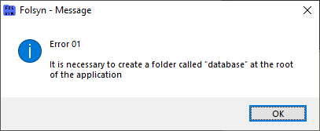

# Erro 01

Mensagem que aparece ao abrir o software. Ela aparece pois não foi possível criar o banco de dados pela falta da pasta **database**

Mensagem de erro:

## Solução

Na pasta onde fica o arquivo executável **FolSyn_v1.exe,** criar uma pasta chamada **database**.