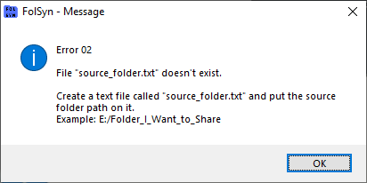

# Erro 02

Quando a aplicação não consegue encontrar o arquivo com o caminho da pasta local, que será replicada para as outras máquinas.

Mensagem de erro:

## Solução

Na pasta onde fica o arquivo executável **FolSyn_v1.exe,** criar um um arquivo de texto chamado **source_folder.txt**.

Dentro deste arquivo, inserir o caminho da pasta local que será replicada.

Exemplo: E:/Filmes

Esse arquivo deve ter apenas uma pasta, que será a pasta original. Quem vai ser copiada para as outras pastas.