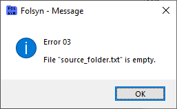

# Erro 03

Ao clicar no botão **Sync**, significa que o arquivo **source_folder**.**txt** (ver Error 02) está vazio.

Mensagem de erro:

## Solução

Insira o caminho para a pasta a ser replicada no arquivo **source_folder.txt**