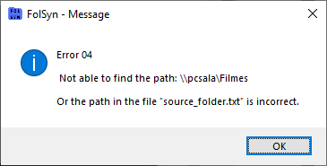

# Erro 04

Quando o caminho cadastrado para uma pasta compartilhada, não é encontrado, ou a pasta local inserida no arquivo **source_folder.txt**, não é valida.

Mensagem de erro:

## Solução

1 - Verificar se está pingando a máquina destino

2 - Verificar se a pasta no destino, está compartilhada e com a permissão de escrita para **Todos**

3 - Verificar o arquivo **source_folder.txt**, se o caminho para a pasta local, está correto (barras não podem estar invertidas)

4 - Verificar se consegue escrever no destino via rede